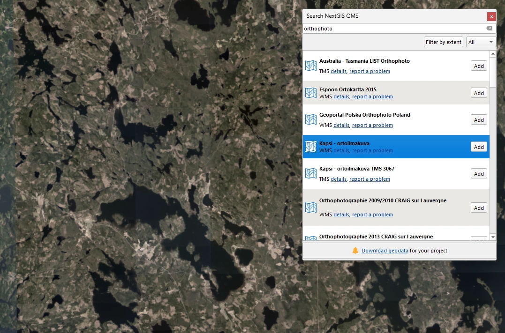
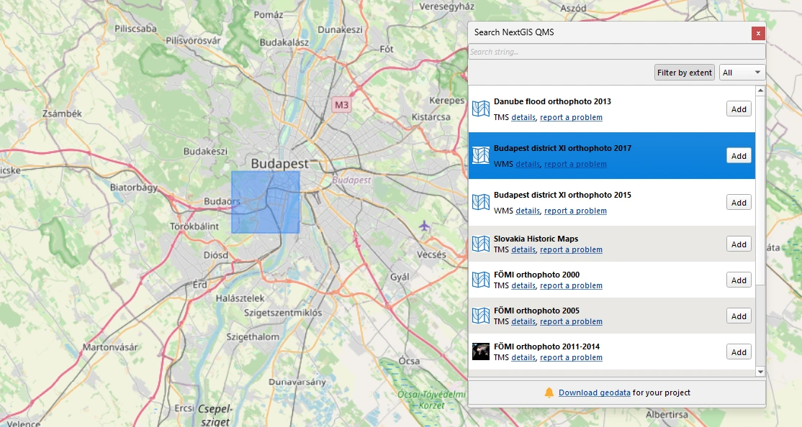
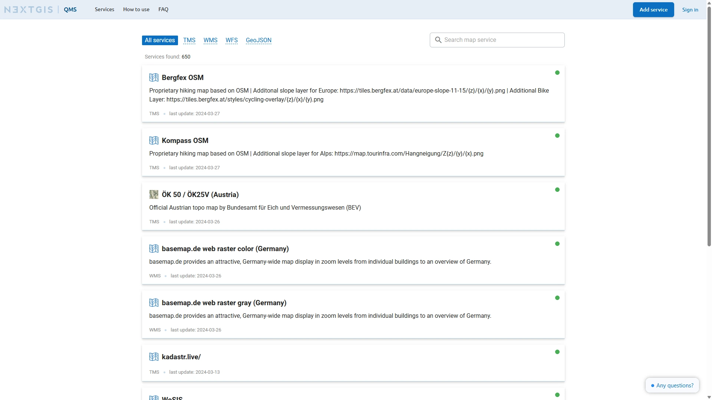

# QuickMapServices

**QuickMapServices (QMS)** is a QGIS plugin that allows you to quickly search, discover and add basemaps and geospatial web services to your QGIS project.

Instead of manually configuring service URLs and parameters, you can simply search for a service by name and add it to the map in one click.

The plugin uses the open [**QuickMapServices catalog**](https://qms.nextgis.com), a curated collection of geospatial services contributed by the community.

## Table of Contents

- [Features](#features)
- [Why QuickMapServices](#why-quickmapservices)
- [QuickMapServices Catalog](#quickmapservices-catalog)
- [Installation](#installation)
- [Usage](#usage)
- [Contributing](#contributing)
  - [Add new services](#add-new-services)
  - [Improve the plugin](#improve-the-plugin)
- [Documentation](#documentation)
- [Community](#community)
- [Commercial support](#commercial-support)
- [License](#license)

## Features

- Quickly search for geospatial services directly inside QGIS

- Add basemaps in one click
- Access hundreds of services from the public QMS catalog
- Filter services by map extent

- Save recently used services for faster access
- Simple and familiar workflow integrated into QGIS

Supported service types include:

- XYZ/TMS
- WMS
- WFS
- GeoJSON

## Why QuickMapServices

Many public basemaps and geospatial services exist on the web, but configuring them manually requires copying URLs, setting parameters, and understanding service specifications.

QuickMapServices simplifies this process by providing:

- a searchable catalog of services
- one‑click addition of services to QGIS

This helps GIS users focus on analysis and mapping instead of service configuration.

## QuickMapServices Catalog

QuickMapServices relies on an open catalog of geospatial services available at https://qms.nextgis.com

The catalog allows users to:

- browse available basemaps and geodata services
- view service metadata and previews
- contribute new services to the catalog
- reuse the catalog in external GIS tools and applications

The catalog is community‑driven and continuously updated.

## Installation

The easiest way to install the plugin is through the QGIS Plugin Manager.

1. Open **Plugins → Manage and Install Plugins**
2. Search for **QuickMapServices**
3. Click **Install Plugin**

After installation the plugin will appear in the **Web** menu and toolbar.

## Usage

1. Open the **QuickMapServices Search** panel
2. Enter the name of a service (for example *OpenStreetMap* or *Satellite*)
3. Double‑click the service to add it to the map

The selected service will be added to your QGIS project.

## Contributing

You can contribute to the QuickMapServices ecosystem in several ways:

### Add new services

New services can be added through the [catalog interface](https://qms.nextgis.com)

### Improve the plugin

Bug reports and feature requests are welcome through [GitHub issues](https://github.com/nextgis/quickmapservices/issues).

## Documentation

📘 [QuickMapServices plugin](https://docs.nextgis.com/docs_ngqgis/source/qms.html)

📘 [QMS Catalog FAQ](https://qms.nextgis.com/faq)

## Community

💬 [Community forum](https://community.nextgis.com)

## Commercial support

Professional support, enterprise GIS solutions, and consulting services are available from the NextGIS team.

🌍 [NextGIS Website](https://nextgis.com)  

✉️ [Contact us](https://nextgis.com/contact/)

## License

This project is licensed under the **GNU General Public License v2 or later (GPL v2+)**.
